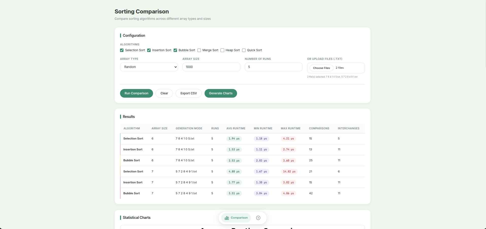
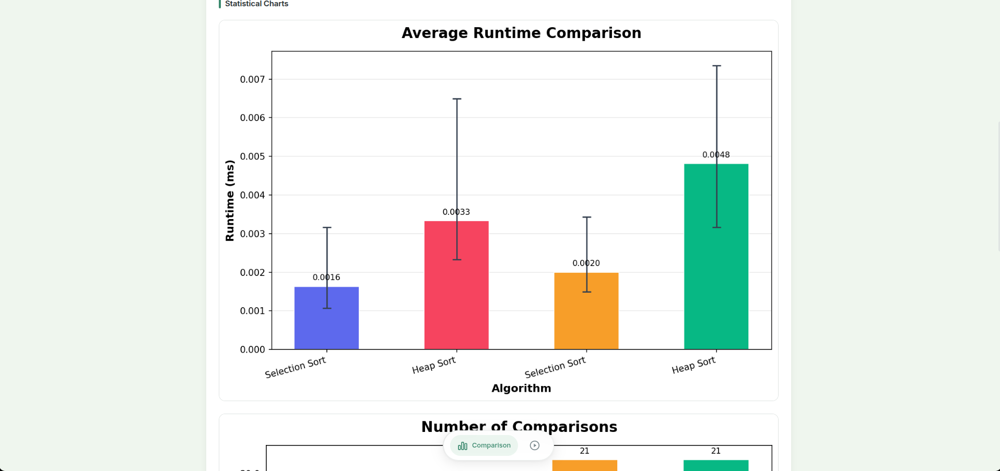
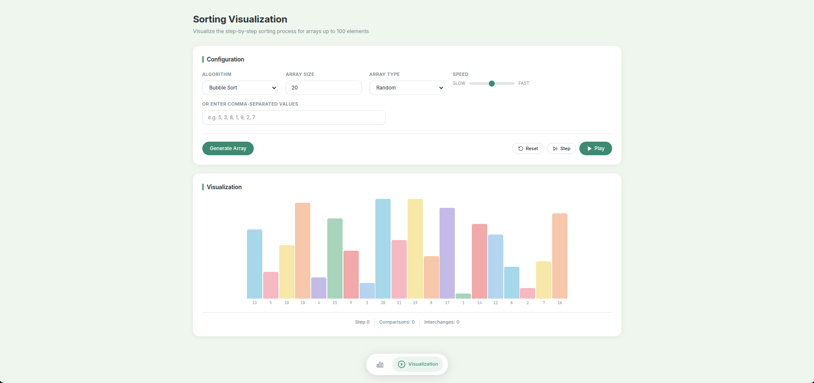
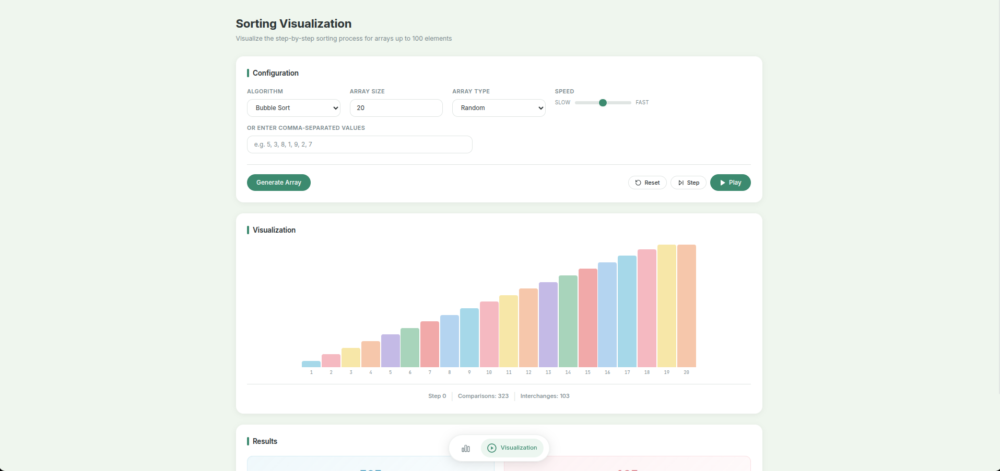

# Sorting Algorithms Comparison & Visualization

A comprehensive web application designed to implement, compare, and visualize six classical sorting algorithms. Built with a Java Spring Boot backend and an Angular frontend, this project allows users to rigorously test the numerical performance of different sorting strategies and visually observe their step-by-step execution.

## Application Interface

### Comparison Mode

*Configuring multiple algorithms to sort custom uploaded files, showing a detailed results table.*

### Statistical Charts

*Python-generated charts displaying average runtime with min/max error bars, comparisons, and interchanges.*

### Visualization Mode

*Initial randomly generated array ready for visualization.*


*Sorting in progress, highlighting elements currently being compared or swapped.*

## Features

### 1. Sorting Comparison
Compare the performance of different sorting algorithms on large datasets.
- **Algorithms Supported:** Selection Sort, Insertion Sort, Bubble Sort, Merge Sort, Heap Sort, Quick Sort.
- **Array Generation:** Generate arrays up to 10,000 elements (Random, Sorted, Inversely Sorted).
- **Custom Input:** Upload multiple text files containing comma-separated integers to use as datasets.
- **Metrics Tracked:** Average Runtime, Minimum/Maximum Runtime, Total Comparisons, Total Interchanges (Swaps).
- **Statistical Charts:** Automatically generates bar charts with error bars (via Matplotlib) to visualize runtimes, comparisons, and interchanges.
- **Export to CSV:** Download comparison results directly to your local machine.

### 2. Sorting Visualization
Observe the step-by-step process of how each algorithm sorts an array.
- **Visual Representation:** Array elements are represented as vertical bars, where the height corresponds to the value. Colors dynamically update to indicate comparing, swapping, or sorted elements.
- **Customization:** Choose array size (up to 100 elements), generation type, and playback speed (slow to fast).
- **Manual Input:** Optionally provide a custom comma-separated list of numbers to visualize.
- **Playback Controls:** Play, pause, reset, or step forward manually through the algorithm's execution.
- **Live Metrics:** Real-time tracking of the current step, number of comparisons, and number of interchanges.


## Technology Stack

### Backend
- **Java 21**
- **Spring Boot 3** (REST API)
- **Server-Sent Events (SSE)** for streaming visualization frames
- **Python & Matplotlib** (Script executed by Java for generating statistical charts encoded in Base64)

### Frontend
- **Angular 17+** (TypeScript, HTML, CSS)
- **RxJS** (Event handling and SSE consumption)

## Prerequisites

- **Java JDK 17+** 
- **Node.js** (v18+) and **npm**
- **Python 3** installed and accessible via the `python3` command (with `pandas` and `matplotlib` pip packages installed)
- **Maven** (for building the backend)

## Running the Application

### 1. Start the Backend
Navigate to the backend directory and run the Spring Boot application:
```bash
cd backend
mvn spring-boot:run
```
The API will be available at `http://localhost:8080`.

### 2. Start the Frontend
Navigate to the frontend directory, install dependencies, and start the Angular development server:
```bash
cd frontend
npm install
npm start
```
The Web UI will be available at `http://localhost:4200`.

## Architecture Overview

- The backend utilizes the **Strategy Pattern** to define `SortingStrategy` implementations. Each sorting algorithm is a component injected into the `SortingContext`.
- Comparison requests execute the algorithms synchronously and return JSON metrics.
- Chart generation delegates data serialization to a Python script `graph.py` to leverage Matplotlib's powerful graphing capabilities, converting images to Base64 to serve directly to the frontend without persistent file storage.
- Visualization requests open an SSE stream. The backend algorithm implementations use a `.sortWithSteps()` method taking a `Consumer<SortingStep>`. As the algorithm iterates, it yields the current array state to the frontend in real-time.
