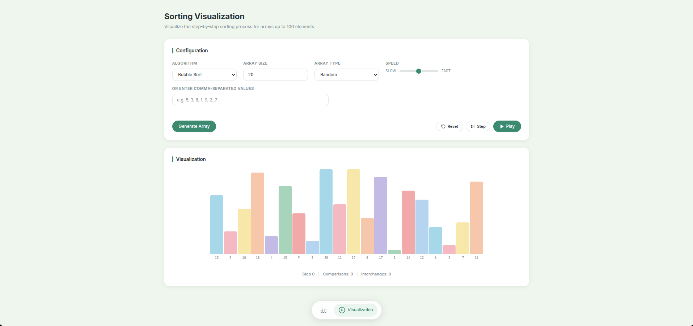

<div align="center">

# Sorting Algorithms Visualization

**A full-stack tool to compare and visualize six classical sorting algorithms — step-by-step animation via SSE and statistical benchmarking via Matplotlib.**


</div>

---

## Overview

Two modes in one app: a **comparison mode** that runs algorithms on large datasets and generates statistical bar charts (via Matplotlib), and a **visualization mode** that streams step-by-step array state to the frontend via SSE, rendering color-coded bar animations in real time. Heap Sort and Merge Sort also render true hierarchical tree structures during execution.

---

## Demo

[](https://github.com/janamirashed/sorting-algorithms/raw/main/frontend/public/assets/demo.mp4)

*Click the image to download and watch the full demo video.*

---

## Features

**Comparison Mode**
- Algorithms: Selection Sort, Insertion Sort, Bubble Sort, Merge Sort, Heap Sort, Quick Sort
- Array generation up to 10,000 elements — Random, Sorted, or Inversely Sorted
- Custom dataset upload via comma-separated text files
- Metrics: average/min/max runtime, total comparisons, total swaps
- Statistical bar charts with error bars generated by Matplotlib and served as Base64
- Export results to CSV

**Visualization Mode**
- Live bar chart animation with color-coded compare/swap/sorted states
- True hierarchical tree layouts for Heap Sort and Merge Sort
- Array size up to 100 elements, configurable speed and generation type
- Playback controls: play, pause, step, reset
- Live metrics: current step, comparisons, interchanges

---

## Design Patterns

| Pattern | Where |
|---------|-------|
| Strategy | `SortingStrategy` interface — each algorithm is a separate injectable component |

---

## Tech Stack

| Layer | Technology |
|-------|------------|
| Backend | Java 17, Spring Boot 3.4, SSE (visualization streaming) |
| Charts | Python 3, Matplotlib, Pandas — invoked by Java, results returned as Base64 |
| Frontend | Angular 19, TypeScript, RxJS |
| Build | Maven, Angular CLI |

---

## Running Locally

**Prerequisites:** Java 17+, Maven, Node.js 18+, Python 3 with `matplotlib` and `pandas`

**Backend**
```bash
cd backend
./mvnw spring-boot:run
```
API available at `http://localhost:8080`

**Frontend**
```bash
cd frontend
npm install
npm start
```
App available at `http://localhost:4200`

---

## Author

Jana Rashed — [GitHub](https://github.com/janamirashed) · [LinkedIn](https://www.linkedin.com/in/jana-rashed/) · [Portfolio](https://janamirashed.github.io/my-portfolio/)
